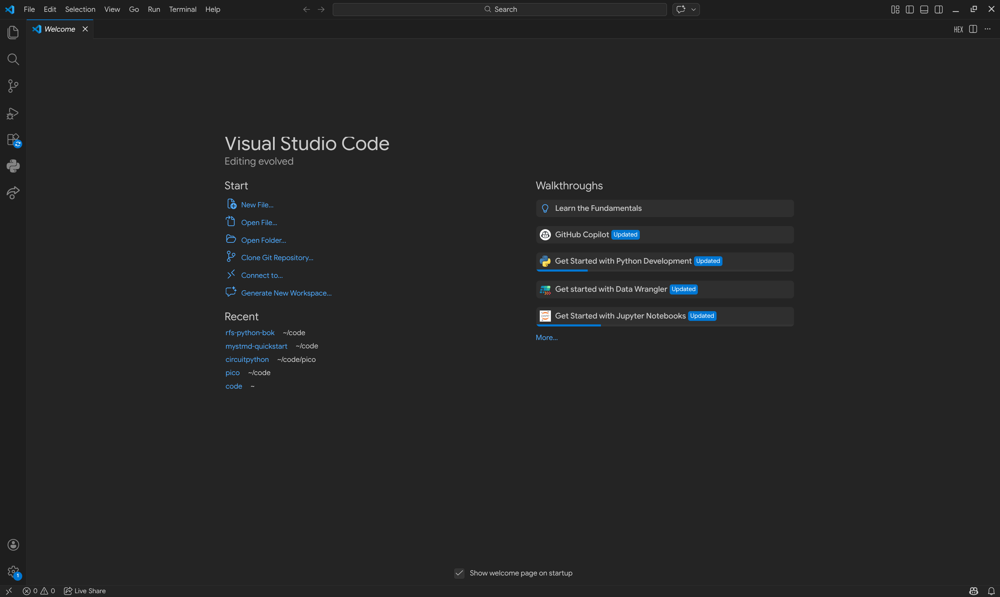

# Hello, World!

Grattis! Nu vet du grunder i vad programmering är, och har bekantat dig grundligt med terminalen! Nu är det faktiskt dags att prata om Python specifikt.

Sedan urminnes tider har man verifierat att sin programmeringsmiljö fungerar genom att skriva ut orden "Hello, World!", så det är det vi kommer att jobba upp till i detta kapitel.

## Först med en REPL

Det allra lättaste sättet att testa kort kod är via en REPL som tidigare nämnt i [tidigare kapitel](#repl-intro).

Vi använder metodiken där, och får då som innan

```console
> python
Python 3.14.2 (main, Jan  2 2026, 14:27:39) [GCC 15.2.1 20251112] on linux
Type "help", "copyright", "credits" or "license" for more information.
>>> print("Hello, World!")
Hello, World!
>>> quit()
>
```

Testa gärna att göra detta själv i din egen terminal!

## Nu med en kodfil som vanligt

Först, behöver du öppna och bekanta dig med VSCode. Vår utvecklingsmiljö för RFS. Det är typ det mest populära idag, och det är riktigt smidigt att använda. VSCode och alla tillbehör du behöver kommer förinstallerat på era datorer från lägret.

```{note} Om du har egen dator
:class: dropdown
Som ni blivit informerade föredrar vi användning av skolans datorer under programmeringsmomenten, och det är endast för de vi har tid att ge utförligt tekniskt stöd. Däremot om du har en egen dator och är bekväm med att använda den, hittar du det du behöver på [code.visualstudio.com](https://code.visualstudio.com). Du behöver även ladda ned en extension som heter [Python](https://marketplace.visualstudio.com/items?itemName=ms-python.python) samt [CircuitPython v2](https://marketplace.visualstudio.com/items?itemName=wmerkens.vscode-circuitpython-v2) för att kunna hänga med.

Du behöver också en fungerande version av Python ≥3.10, dock helst senaste 3.14. Det kan du skaffa dig på [python.org](https://www.python.org/downloads).
```

När du startar upp VSCode kommer det att se ut ungefär såhär:



```{caution} Angående GitHub Copilot och andra LLM:er
VSCode, likt andra utvecklingsmiljöer idag, är ganska centrerad kring användandet av AI (mer specifik {abbr}`LLM (Large Language Model)`:er) för att skriva sin kod. Ofta kommer en ny installation av VSCode med ett AI fönster redan öppnat till höger.

**På RFS avråder vi bestämt från att använda AI för att skriva din kod åt dig!** Det kommer däremot inte råda något direkt förbud mot användningen av AI, dels för att det är omöjligt för handledarna att avgöra och för att AI är ett jättekraftfullt verktyg ni bör använda er av även under RFS så länge ni gör det ansvarsfullt.

Det må låta motsägelsefullt, men när vi säger att AI:n inte skall "skriva din kod åt dig" betyder det inte att ni inte får fråga AI om er kod och be om hjälp för att förstå vart ni har gått fel. LLM:er är superduktiga på att ge utförliga beskrivningar av kod och hur man kan göra saker bättre. De är även riktigt duktiga på att hitta vanliga fel. Utnyttja det!

### AI-riktlinjer för programmering
- **NI KAN med fördel** ställa frågor som "varför funka inte denna kod?" för att felsöka.
- **NI KAN med fördel** be AI:n hjälpa er med syntaxen av språket, t.ex. med en fråga som "hur skriver jag en loop som itererar över elementen i en lista i python?"
***
- **NI SKA ALLTID** ställa fråga "varför?" när ni får ett svar av AI. Tänk igenom, nu när ni fått svaret, varför det funkar så att ni lär er något av det.
***
- **NI BÖR INTE** be AI:n skriva hela lösningar som ni sedan tar och inför utan att ifrågasätta. Ni kommer inte lära er så.
- **NI BÖR INTE** ta AI:ns svar som garanterad sanning. Den kan hallucinera, ha fel och föreslå mycket ineffektiva lösningar. Fråga era handledare om tips i första hand, och AI:n i andra hand.

Det är ert lärande som ni påverkar negativt med dåliga AI-vanor. Ni kommer inte lära er om ni låter en dator göra allt tänkande åt er. Däremot är AI ett verktyg ni bör ha i er arsenal för att lösa problem.
```
